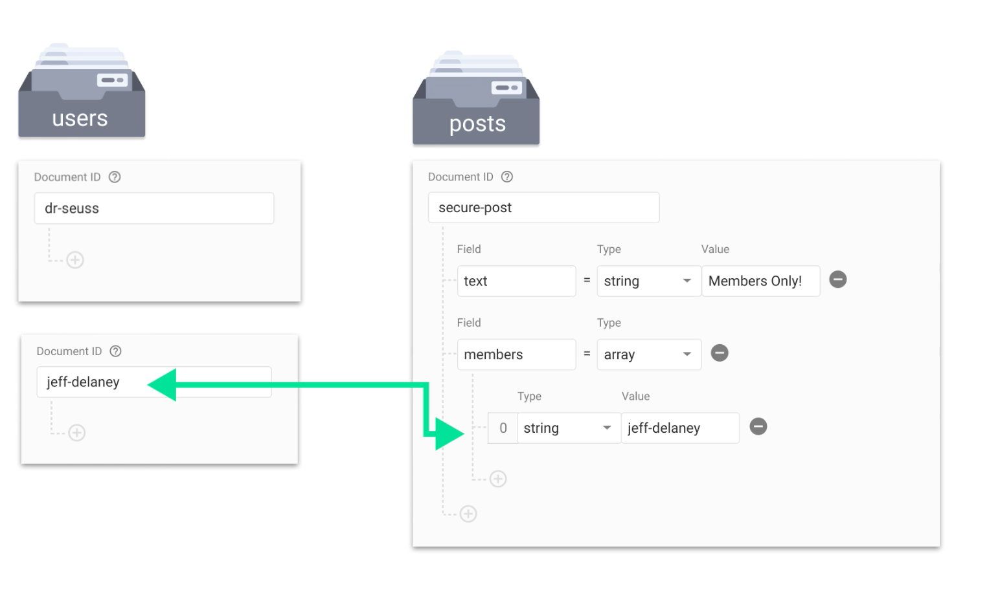

Access Control List (ACL), where the content determines which users have authorization.




```js
// rules.json
match /posts/{document} {
    allow read;
    allow write: if resource.data.members.hasAny(request.auth.uid);
}
```

Also possible: Mix of access and role based access:
User has roles that define access AND posts have access control list.

