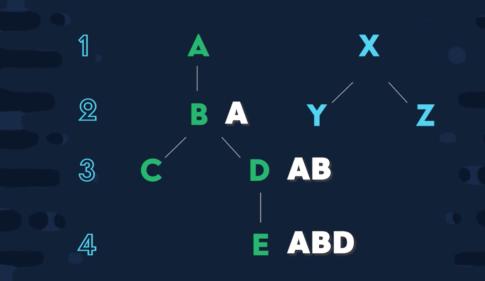

Tree / Hierarchy for threaded comments.



Also an option: Save the level number to each document. This makes it easy to traverse the bredth or width of the tree.

```js
const topLevel = db.collection('comments').where('parent', '==', false);

const traverseBredth = level => db.collection('comments').where('level', '==', level);

const traversDepth = id => {
    return db.collection('comments')
    .where('parent', '>=', id)
    .where('parent', '<=', `${id}~`)
}

// 

const level = db.collection('comments').where('parent', '==', id)

const traverseAll = (id) => {
    const tree = db.collection('comments')
    .where('parent', '>=', id)
    .where('parent', '<=', `${id}~`)
}


```js